# PL/SQL Window Functions Analysis: ConsTruck Limited

**Course:** Database Development with PL/SQL  
**Student:** Milliam Kamanzi  
**Student ID:** 27523  
**Assignment:** Individual Assignment I – Window Functions Mastery Project  
**Submission Date:** September 29, 2025  
**Repository:** plsql-window-functions-milliam-kamanzi

---

## Step 1: Problem Definition

**Business Context**  
ConsTruck Limited is a leading Rwandan company specializing in construction equipment rental and maintenance, serving contractors and businesses across Kigali, Rubavu, Huye, and Musanze. The Fleet Operations team oversees equipment allocation, customer rentals, and preventive maintenance to ensure optimal fleet utilization and profitability.

**Data Challenge**  
Management faces challenges in identifying which equipment and customers generate the most value, understanding rental and maintenance trends by region and season, and segmenting customers for targeted offers. Without actionable insights, decisions on fleet expansion, marketing, and maintenance scheduling are often reactive and suboptimal.

**Expected Outcome**  
By leveraging advanced SQL window functions, this project will uncover top-performing equipment and customers, reveal rental and maintenance patterns, and enable customer segmentation for improved marketing and operational efficiency. The analysis will support data-driven decisions to boost profits and customer satisfaction.

---

## Step 2: Success Criteria (5 Measurable Goals)

| Success Criteria                        | Window Function Used | Analysis Type                  | Screenshot File                |
|-----------------------------------------|---------------------|-------------------------------|-------------------------------|
| 1. Identify top 5 equipment per region  | RANK()              | Regional Equipment Rankings    | screenshots/8-topEquipments.png |
| 2. Track monthly rental revenue trends  | SUM() OVER()        | Cumulative Totals Analysis     | screenshots/7-aggregateMonthyRentals.png |
| 3. Analyze month-over-month growth      | LAG(), LEAD()       | Growth Percentage Calculations | screenshots/10-LAG.png, screenshots/11-Lead.png |
| 4. Segment customers into quartiles     | NTILE(4)            | Customer Segmentation          | screenshots/12-NTILE.png |
| 5. Calculate moving average maintenance | AVG() OVER()        | Maintenance Cost Trends        | screenshots/14-averageMaintainance.png |

**Details:**  
- Top equipment per region: Use RANK() to spotlight high-performing assets in each area.
- Monthly rental revenue: Use SUM() OVER() to visualize revenue accumulation and seasonality.
- Growth analysis: Use LAG()/LEAD() to measure rental growth and anticipate future trends.
- Customer quartiles: Use NTILE(4) to group customers for tailored marketing.
- Moving averages: Use AVG() OVER() to smooth maintenance cost fluctuations and plan budgets.

---

## Step 3: Database Schema Design

**Entity Relationship Diagram**

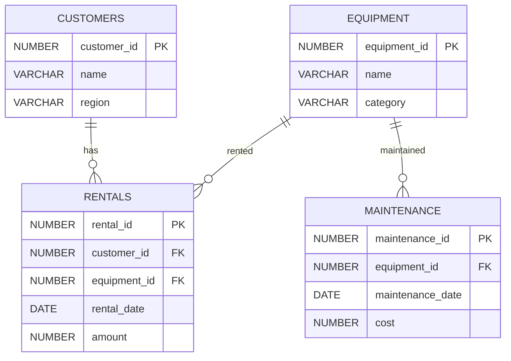

**Table Overview**

| Table      | Purpose                        | Key Columns                                             | Example Row                                  |
|------------|-------------------------------|--------------------------------------------------------|----------------------------------------------|
| customers  | Customer info and region data  | customer_id (PK), name, region                         | 1001, John Doe, Kigali                       |
| equipment  | Equipment catalog              | equipment_id (PK), name, category                      | 2001, Excavator, Earthmoving                 |
| rentals    | Rental transaction records     | rental_id (PK), customer_id (FK), equipment_id (FK), rental_date, amount | 3001, 1001, 2001, 2024-01-15, 250000         |
| maintenance| Maintenance records            | maintenance_id (PK), equipment_id (FK), maintenance_date, cost | 4001, 2001, 2024-01-20, 50000                |

**Screenshots:**  
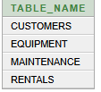
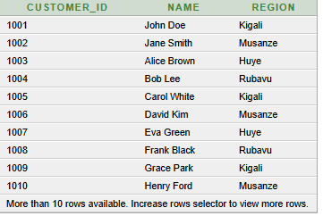  
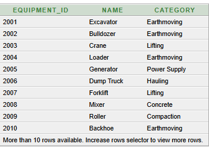  
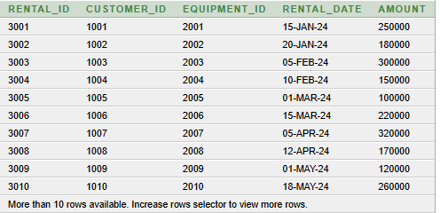  
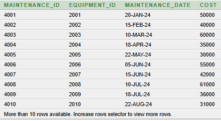

---

## Step 4: Window Functions Implementation

All window function queries are located in [`window_functions.sql`](./window_functions.sql).

### 4.1 Ranking Functions – Regional Equipment Leaders

**Screenshot:**  
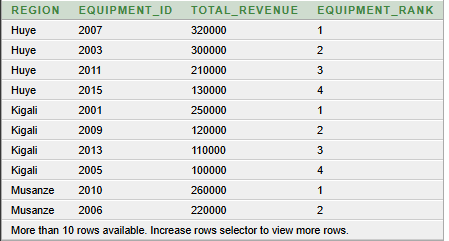
_Interpretation:_  
Ranks equipment by rental revenue within each region, guiding fleet allocation and investment.

### 4.2 Aggregate Functions – Revenue Trends

**Screenshot:**  
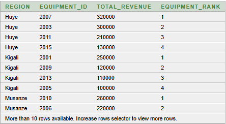
_Interpretation:_  
Shows cumulative rental revenue, revealing seasonal peaks and growth periods.

### 4.3 Navigation Functions – Growth Analysis

**Screenshot:**  
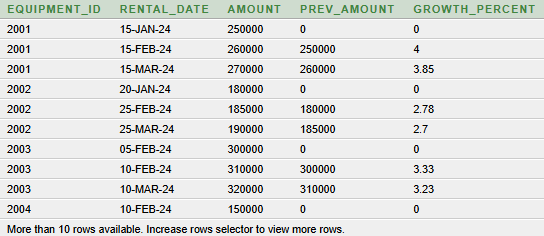  
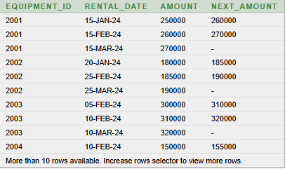
_Interpretation:_  
Compares rental amounts month-to-month and forecasts future performance.

### 4.4 Distribution Functions – Customer Segmentation

**Screenshot:**  
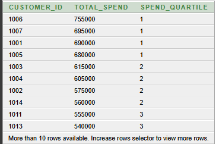  
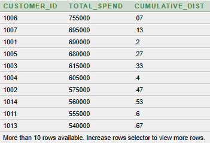
_Interpretation:_  
Groups customers by spend, supporting targeted offers and loyalty programs.

### 4.5 Additional Window Functions

- 3-month moving average maintenance cost: 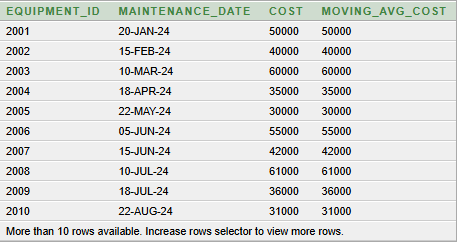
- DENSE_RANK for equipment revenue: 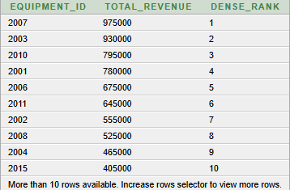
- MAX rental amount per equipment: 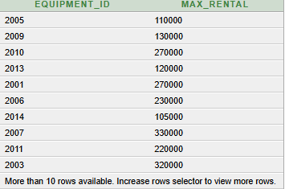
- Total maintenance cost per equipment: 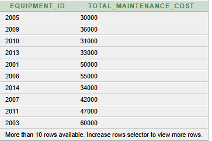
- Partitioned rental count per customer: 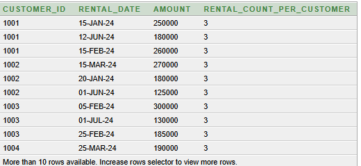
- First rental date per equipment: 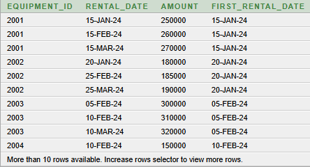
- Last maintenance cost per equipment: 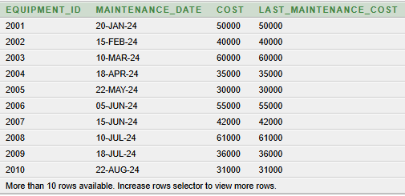

---

## Step 5: Results Analysis

**Descriptive Analysis – What Happened?**  
Analysis revealed that certain equipment types consistently outperform others in specific regions, and a small group of customers account for a large share of rental revenue. Maintenance costs spike during busy seasons, and running totals highlight periods of high demand.

**Diagnostic Analysis – Why These Patterns Occur?**  
Regional construction booms and customer preferences drive equipment demand. High-value customers tend to rent premium equipment more often. Maintenance cost surges align with increased fleet usage, indicating the need for proactive servicing.

**Prescriptive Analysis – Recommended Actions**  
ConsTruck Limited should focus marketing on high-value customers and regions with strong equipment performance. Scheduling maintenance before peak periods can reduce downtime. Fleet expansion should prioritize equipment types with proven demand.

---

## Step 6: Technical Implementation & Repository Structure

```
plsql-window-functions-milliam-kamanzi/
├── README.md
├── create_tables.sql
├── populate_tables.sql
├── window_functions.sql
├── sample_rentals_data.sql
├── screenshots/
│   ├── 1-customers.png
│   ├── 2-equipment.png
│   ├── 3-rentals.png
│   ├── 4-maintenance.png
│   ├── 5-schema.png
│   ├── 6-ranking.png
│   ├── 7-aggregateMonthyRentals.png
│   ├── 8-topEquipments.png
│   ├── 9-frameComparison.png
│   ├── 10-LAG.png
│   ├── 11-Lead.png
│   ├── 12-NTILE.png
│   ├── 13-cumedist.png
│   ├── 14-averageMaintainance.png
│   ├── 15-denseRank.png
│   ├── 16-maxRental.png
│   ├── 17-totalMaintainanceperEquipement.png
│   ├── 18-countOver.png
│   ├── 19-firstValueOver.png
│   ├── 20-lastValueOver.png
└── .git/
```

---

## Step 7: References

- Oracle Corporation. (2024). Oracle Database SQL Language Reference – Analytic Functions.
- TechOnTheNet. (2024). Oracle / PLSQL: Analytic Functions.
- Course Lecture Notes. (2025). Database Development with PL/SQL.
- W3Schools. (2024). SQL Window Functions.
- TutorialsPoint. (2024). SQL Window Functions Tutorial.
- GeeksforGeeks. (2024). SQL Window Functions Explained.
- Mode Analytics. (2024). SQL Window Functions Guide.
- Stack Overflow. (2024). SQL Window Functions Q&A.
- Towards Data Science. (2024). Window Functions in SQL.
- AUCA Library Database Resources. (2025).

---

## Academic Integrity Statement

All sources were properly cited. Implementations and analysis represent original work. No AI-generated content was copied without attribution or adaptation. The business context, database design, and analysis reflect my own work and understanding.
